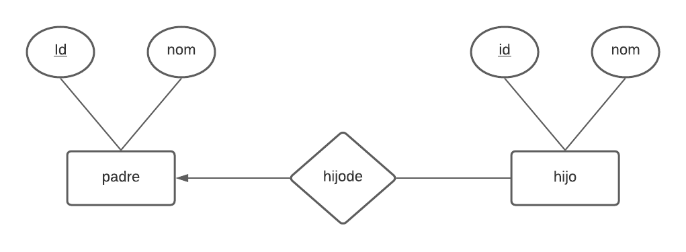

# BIENESTAR (CRUD: Javascript, Node.js, Express.js y MariaDB)

A hypothetical case is presented, in which the [Colombian Institute of Family Welfare](https://www.icbf.gov.co/) asks to implement an information system that allows knowing the real situation of children and girls who are in their charge and / or maintenance of their relationship with their father. Considering that:

- A parent must be able to register without dependent children.
- A parent requires identification and a name; for a child an ID, a name and the parent's ID (optional) are required.
- A child can register without the parent or guardian information, either because it is not currently available or because he or she is an orphan.

The following Entity-Relationship model is proposed for modeling the database:



In addition, the following Relational Model Scheme is presented for the implementation of the database:


### Build with

Databse:
- [FirebirdSQL](https://firebirdsql.org/)
- The [Firebird](https://github.com/xdenser/node-firebird-libfbclient#readme) driver was used to connect to the database.

Backend and server creation:
- [Javascript](https://developer.mozilla.org/es/docs/Web/JavaScript)
- [Node.js](https://nodejs.org/en/)
- [Express.js](https://expressjs.com/)

Frontend and UI:
- [HTML5](https://html.spec.whatwg.org/)
- [Embedded JavaScript templating (EJS)](https://ejs.co/)
- Temas [Bootswatch](https://bootswatch.com/) para [Bootstrap](https://bootswatch.com/)

## Project creation

You can configure this project locally by cloning this repository.

### Prerequisites

- npm
  ```
  npm install
  ```
- [MariaDB](https://mariadb.org/)

### Installation

1. Download and configure the database engine [FirebirdSQL](https://firebirdsql.org/). Also, it is recommended to use the [SQL Manager for InterBase/Firebird](https://www.sqlmanager.net/products/ibfb/manager) client for database administration.

2. Create the database.

3. Clone the repo:
   ```
   https://github.com/Euphorichuman/CRUD-Firebird.git
   ```
4. Install the dependencies (NPM packages):
   ```
   npm install
   ```

## Features

With this project you can create, read, update and delete data in the database through the information system. Currently, the information system has the following functions implemented:

- Insert, update and delete data in the list of children (table of children).

- Insert, update and delete data in the parent list (parent table).

- Shows available parents; when choosing one of them to show the code and name of the children associated with it.

- Shows a list of parents who do not have children.

- Shows a list of children who do not have parents.

- Shows a list of parents who have children, with the number of children each has.

## Contribuciones
All **Pull Requests** are welcome. For major changes, please open an issue first to discuss what you would like to change.

Be sure to update the tests accordingly.

## Authors
This information system (CRUD) was created by:

- [Martin Fuentes](https://github.com/Euphorichuman)
- [Jair Barcasnegras](https://github.com/theblackbar)
- [Helymar Acosta](https://github.com/helymar)

## License

This project is under the license Apache License 2.0. See the [LICENSE](https://github.com/Euphorichuman/CRUD-Firebird/blob/main/LICENSE) file for more details.

[APACHE LICENSE, VERSION 2.0](http://www.apache.org/licenses/LICENSE-2.0)
